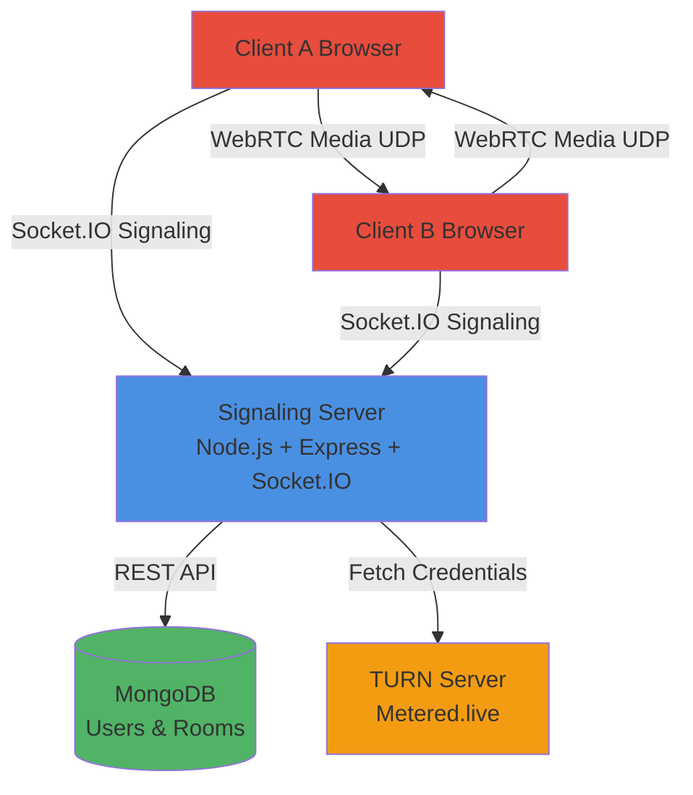
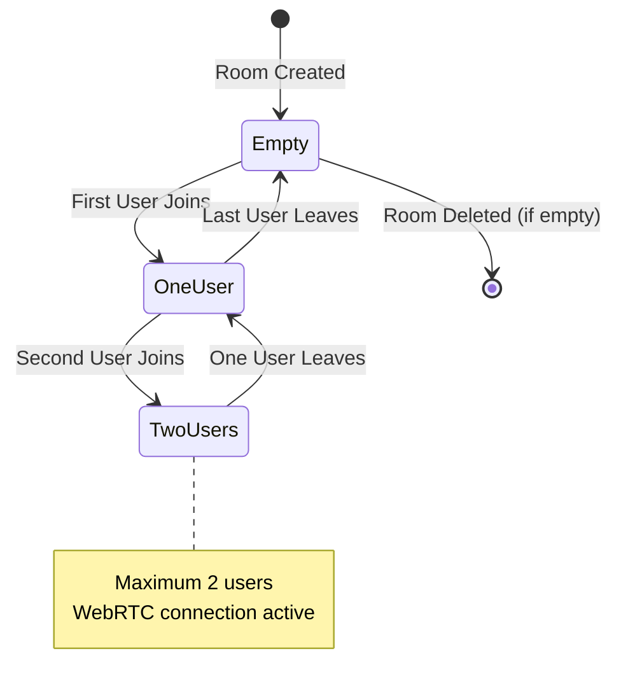
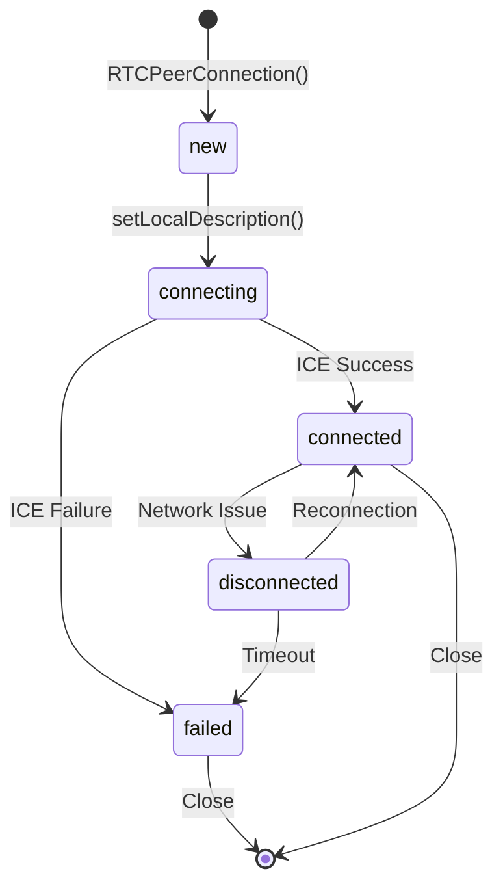

# WebRTC Real-Time Communication Application

A WebRTC-based real-time communication platform that enables users to create or join rooms (maximum 2 users per room) for peer-to-peer audio/video communication, text chat, screen sharing, and interactive gaming. The application uses a Node.js + Express + Socket.IO signaling server to facilitate WebRTC connection establishment.

## Overview

This project implements a complete WebRTC communication system where users can:
- Authenticate and manage their accounts
- Create public or private rooms with different types (game, business, coding, learning, language)
- Join rooms and establish peer-to-peer WebRTC connections
- Communicate via audio/video streams
- Exchange text messages in real-time
- Share their screen during calls
- Play interactive games (Tic-Tac-Toe) in game-type rooms

The architecture follows the standard WebRTC pattern: a signaling server handles connection metadata exchange, while actual media traffic flows directly between peers using UDP.

## Key Features

- **User Authentication**: JWT-based authentication system with signup and signin
- **Room Management**: Create public or private rooms with unique room IDs
- **WebRTC Video/Audio Calls**: Peer-to-peer communication with up to 2 users per room
- **Real-Time Chat**: Text messaging during video calls via Socket.IO
- **Screen Sharing**: Share screen content during calls
- **Interactive Games**: Tic-Tac-Toe game implementation for game-type rooms
- **Media Controls**: Mute/unmute audio and video tracks
- **TURN Server Support**: Integration with Metered.live TURN service for NAT traversal

## Technologies Used

### Backend
- **Node.js**: Runtime environment
- **Express.js**: Web framework for REST API
- **Socket.IO**: Real-time bidirectional communication for signaling
- **MongoDB**: Database for user and room persistence
- **Mongoose**: MongoDB object modeling
- **JWT (jsonwebtoken)**: Authentication token management
- **bcrypt**: Password hashing
- **UUID**: Unique room ID generation

### Frontend
- **HTML5/CSS3/JavaScript**: Core web technologies
- **WebRTC APIs**: 
  - `RTCPeerConnection`: Peer connection management
  - `MediaStream`: Audio/video stream handling
  - `getUserMedia`: Local media capture
  - `getDisplayMedia`: Screen sharing

### Infrastructure
- **Metered.live**: TURN server service for NAT traversal

## High-Level Architecture

The application follows a client-server architecture with peer-to-peer media communication:

```
┌─────────────┐         ┌─────────────┐
│   Client A  │         │   Client B  │
│  (Browser)  │         │  (Browser)  │
└──────┬──────┘         └──────┬──────┘
       │                        │
       │  Socket.IO Signaling   │
       │  (TCP/WebSocket)       │
       │                        │
       └──────────┬─────────────┘
                  │
         ┌────────▼────────┐
         │ Signaling      │
         │ Server           │
         │ (Node.js +       │
         │  Socket.IO)      │
         └──────────────────┘
                  │
         ┌────────▼────────┐
         │   MongoDB       │
         │   Database      │
         └─────────────────┘

       ┌─────────────────────┐
       │  WebRTC Media       │
       │  (UDP, Direct P2P)  │
       └─────────────────────┘
       Client A ←────────→ Client B
```

## System Components

### Backend Components

1. **Express REST API** (`index.js`)
   - `/signup`: User registration
   - `/signin`: User authentication
   - `/profile`: Get user profile (JWT protected)
   - `/rooms`: Create and list rooms
   - `/join-room`: Join a room by room ID
   - `/webrtc/ice`: Get TURN server credentials

2. **Socket.IO Signaling Server** (`index.js`)
   - Manages WebRTC signaling events
   - Enforces 2-user maximum per room
   - Routes SDP offers, answers, and ICE candidates
   - Handles chat messages and game events

3. **Database Models**
   - **User Model**: Stores user credentials (name, email, hashed password)
   - **Room Model**: Stores room metadata (name, type, status, roomId, createdBy, allowedUsers)

### Frontend Components

1. **Room Management UI** (`app.html`, `app.js`)
   - Room creation modal
   - Public room listing with filters
   - Private room join interface
   - Search and filter functionality

2. **WebRTC Client** (`app.js`)
   - RTCPeerConnection setup and management
   - Media stream capture and display
   - Signaling event handlers
   - Connection state monitoring

3. **Call Interface** (`app.html`, `app.js`)
   - Video display (local and remote)
   - Control buttons (mute, video, screen share, leave)
   - Chat sidebar
   - Game container

## WebRTC Fundamentals

### What is WebRTC?

WebRTC (Web Real-Time Communication) is a collection of APIs and protocols that enable direct peer-to-peer communication between browsers without requiring plugins or third-party software. It is designed for low-latency, high-quality audio/video streaming.

### Why Use WebRTC?

- **Direct Communication**: Media flows directly between peers, reducing server load
- **Low Latency**: Minimal delay compared to server-relayed solutions
- **High Quality**: Optimized codecs and adaptive bitrate streaming
- **Privacy**: Media traffic doesn't pass through signaling server
- **Standardized**: W3C standard, supported by all modern browsers

### Peer-to-Peer Communication Concept

In traditional client-server architecture, all data flows through a central server. WebRTC enables **peer-to-peer (P2P)** communication where two clients connect directly to each other:

```
Traditional: Client A → Server → Client B
WebRTC:      Client A ←────────→ Client B (direct)
```

However, establishing this direct connection requires:
1. **Signaling**: Exchange connection metadata (not media)
2. **NAT Traversal**: Overcome network barriers (firewalls, NAT)
3. **Media Negotiation**: Agree on codecs, formats, and capabilities

### Core WebRTC Components

#### RTCPeerConnection

The `RTCPeerConnection` interface represents a WebRTC connection between the local computer and a remote peer. It handles:
- Connection establishment and management
- Media stream transmission
- ICE candidate gathering
- Connection state monitoring

**Key Methods:**
- `createOffer()`: Generate SDP offer
- `createAnswer()`: Generate SDP answer
- `setLocalDescription()`: Set local SDP
- `setRemoteDescription()`: Set remote SDP
- `addIceCandidate()`: Add ICE candidate for NAT traversal
- `addTrack()`: Add media track to connection

**Connection States:**
- `new`: Initial state
- `connecting`: ICE gathering in progress
- `connected`: Connection established
- `disconnected`: Temporary disconnection
- `failed`: Connection failed
- `closed`: Connection closed

#### MediaStream

`MediaStream` represents a stream of audio/video content. It contains:
- **Audio Tracks**: Microphone input
- **Video Tracks**: Camera input or screen share

**Key APIs:**
- `navigator.mediaDevices.getUserMedia()`: Capture camera/microphone
- `navigator.mediaDevices.getDisplayMedia()`: Capture screen
- `stream.getTracks()`: Access individual tracks
- `track.enabled`: Enable/disable track

#### SDP (Session Description Protocol)

SDP is a text-based protocol that describes multimedia communication sessions. It contains:
- Media types (audio, video)
- Codecs and formats
- Network information (IP addresses, ports)
- Session metadata

**Offer/Answer Model:**
- **Offer**: Generated by the initiating peer, contains proposed session parameters
- **Answer**: Generated by the receiving peer, contains accepted parameters

**Example SDP Structure:**
```
v=0
o=- 123456789 2 IN IP4 192.168.1.1
s=-
t=0 0
m=audio 9 UDP/TLS/RTP/SAVPF 111
m=video 9 UDP/TLS/RTP/SAVPF 96
```

#### ICE Candidates

ICE (Interactive Connectivity Establishment) candidates represent potential network paths between peers. Each candidate contains:
- **IP Address**: Local or public IP
- **Port**: Network port
- **Protocol**: UDP (preferred) or TCP
- **Type**: 
  - `host`: Direct local network connection
  - `srflx`: Server-reflexive (via STUN)
  - `relay`: Relay (via TURN)

**ICE Gathering Process:**
1. Gather local candidates (host)
2. Query STUN server for public IP (srflx)
3. Request TURN server candidates if needed (relay)
4. Exchange candidates with peer
5. Test connectivity (ICE connectivity checks)
6. Select best path

#### STUN Servers

STUN (Session Traversal Utilities for NAT) servers help peers discover their public IP addresses and ports. They:
- Return the public IP/port seen by the server
- Enable direct connections when both peers have public IPs
- Are lightweight and stateless

**STUN Flow:**
```
Client → STUN Server: "What's my public IP?"
STUN Server → Client: "Your public IP is X.X.X.X:PORT"
```

#### UDP Transport

WebRTC uses **UDP (User Datagram Protocol)** for media transport because:
- **Low Latency**: No connection establishment overhead
- **Real-Time**: No retransmission delays
- **Efficiency**: Lower overhead than TCP
- **Tolerance**: Acceptable packet loss for real-time media

TCP would cause unacceptable delays due to retransmission and flow control.

### Why Signaling is Required

WebRTC cannot establish connections without signaling because:
1. **No Discovery Mechanism**: WebRTC doesn't know how to find the other peer
2. **SDP Exchange Needed**: Offers and answers must be exchanged
3. **ICE Candidate Exchange**: Network path information must be shared
4. **Session Coordination**: Both peers must coordinate connection attempts

**Signaling vs. Media:**
- **Signaling**: Small metadata (SDP, ICE candidates) via reliable channel (Socket.IO/TCP)
- **Media**: Large audio/video streams via direct UDP connection

### Why Socket.IO is Used as Signaling

Socket.IO provides:
- **Bidirectional Communication**: Real-time event-based messaging
- **Reliability**: Automatic reconnection and message queuing
- **Room Management**: Built-in room/namespace support
- **Cross-Browser**: Works across all browsers
- **Ease of Use**: Simple event emitter API

**Alternative Signaling Methods:**
- WebSocket (raw)
- HTTP long polling
- SIP (for telephony)
- XMPP (for instant messaging)

## Signaling Mechanism

The application uses Socket.IO for WebRTC signaling. The following events are implemented:

### Client-to-Server Events

| Event | Payload | Description |
|-------|---------|-------------|
| `join-room` | `{ roomId: string }` | Join a signaling room (max 2 users) |
| `offer` | `{ roomId: string, offer: RTCSessionDescriptionInit }` | Send SDP offer |
| `answer` | `{ roomId: string, answer: RTCSessionDescriptionInit }` | Send SDP answer |
| `ice-candidate` | `{ roomId: string, candidate: RTCIceCandidateInit }` | Send ICE candidate |
| `chat-message` | `{ roomId: string, message: string, sender: string }` | Send chat message |
| `game-select` | `{ roomId: string, gameType: string }` | Select a game |
| `game-move` | `{ roomId: string, gameType: string, moveData: object }` | Send game move |
| `game-reset` | `{ roomId: string, gameType: string }` | Reset game |

### Server-to-Client Events

| Event | Payload | Description |
|-------|---------|-------------|
| `ready` | - | Emitted to first user when second user joins (triggers offer creation) |
| `offer` | `RTCSessionDescriptionInit` | Receive SDP offer from peer |
| `answer` | `RTCSessionDescriptionInit` | Receive SDP answer from peer |
| `ice-candidate` | `RTCIceCandidateInit` | Receive ICE candidate from peer |
| `room-full` | - | Room already has 2 users |
| `player-assign` | `{ symbol: "X" \| "O", isPlayer1: boolean }` | Assigned player role for games |
| `chat-message` | `{ message: string, sender: string }` | Receive chat message |
| `game-select` | `{ gameType: string }` | Game selected by peer |
| `game-move` | `{ gameType: string, moveData: object }` | Receive game move |
| `game-reset` | `{ gameType: string }` | Game reset by peer |

### Room Management Logic

The server maintains an `activeCalls` object tracking socket IDs per room:

```javascript
activeCalls = {
  "room-123": [socketId1, socketId2],
  "room-456": [socketId1]
}
```

**Join Flow:**
1. Client emits `join-room` with `roomId`
2. Server checks if room exists in `activeCalls`
3. If room has 2 users, emit `room-full` and reject
4. Add socket ID to room array
5. If room now has 2 users, emit `ready` to first user
6. Assign player roles (first = X/Player1, second = O/Player2)

**Disconnect Handling:**
- Remove socket ID from all rooms
- Delete room entry if empty
- Other peer's connection remains but becomes inactive

## Network & Protocol Explanation

### Signaling Traffic (Socket.IO)

- **Protocol**: TCP/WebSocket
- **Purpose**: Exchange connection metadata
- **Data**: SDP offers/answers, ICE candidates, chat messages, game events
- **Size**: Small (few KB per message)
- **Path**: Client A → Server → Client B
- **Reliability**: Guaranteed delivery (TCP)

### Media Traffic (WebRTC)

- **Protocol**: UDP (RTP/RTCP)
- **Purpose**: Audio/video stream transmission
- **Data**: Encoded audio/video frames
- **Size**: Large (continuous, ~100KB/s - 2MB/s per stream)
- **Path**: Client A ←→ Client B (direct)
- **Reliability**: Best-effort (UDP, some packet loss acceptable)

### NAT Traversal

Most users are behind NAT (Network Address Translation) routers, which:
- Hide private IP addresses
- Block incoming connections
- Require STUN/TURN for connectivity

**Connection Scenarios:**

1. **Both peers on same network**: Direct connection (host candidates)
2. **Both peers have public IPs**: Direct connection via STUN (srflx candidates)
3. **One or both behind symmetric NAT**: Requires TURN server (relay candidates)

**TURN Server Usage:**
- This application uses Metered.live TURN service
- Endpoint: `/webrtc/ice` returns ICE server configuration
- Used when direct connection fails
- Relays all media traffic (higher latency, server load)

## Connection Flow

The WebRTC connection establishment follows this sequence:

```mermaid
sequenceDiagram
    participant A as Client A
    participant S as Signaling Server
    participant B as Client B
    
    Note over A,B: 1. Room Join Phase
    A->>S: join-room { roomId: "room-123" }
    S-->>A: player-assign { symbol: "X", isPlayer1: true }
    
    B->>S: join-room { roomId: "room-123" }
    S-->>B: player-assign { symbol: "O", isPlayer1: false }
    S->>A: ready (2nd user joined)
    
    Note over A,B: 2. Media Setup Phase
    A->>A: getUserMedia() → localStream
    A->>A: RTCPeerConnection(iceServers)
    A->>A: addTrack(localStream)
    
    B->>B: getUserMedia() → localStream
    B->>B: RTCPeerConnection(iceServers)
    B->>B: addTrack(localStream)
    
    Note over A,B: 3. SDP Exchange Phase
    A->>A: createOffer()
    A->>A: setLocalDescription(offer)
    A->>S: offer { roomId, offer }
    S->>B: offer
    B->>B: setRemoteDescription(offer)
    B->>B: createAnswer()
    B->>B: setLocalDescription(answer)
    B->>S: answer { roomId, answer }
    S->>A: answer
    A->>A: setRemoteDescription(answer)
    
    Note over A,B: 4. ICE Candidate Exchange Phase
    A->>A: onicecandidate (gathering)
    A->>S: ice-candidate { roomId, candidate }
    S->>B: ice-candidate
    B->>B: addIceCandidate(candidate)
    
    B->>B: onicecandidate (gathering)
    B->>S: ice-candidate { roomId, candidate }
    S->>A: ice-candidate
    A->>A: addIceCandidate(candidate)
    
    Note over A,B: 5. Connection Established
    A->>B: ICE connectivity checks (UDP)
    B->>A: ICE connectivity checks (UDP)
    A<->>B: Media Stream (UDP/RTP)
    
    Note over A,B: 6. Ongoing Communication
    A->>S: chat-message { roomId, message, sender }
    S->>B: chat-message { message, sender }
    B->>S: chat-message { roomId, message, sender }
    S->>A: chat-message { message, sender }
```

### Detailed Step-by-Step Flow

1. **User A joins room:**
   - Clicks on a room or enters room ID
   - Frontend calls `startCall(roomId)`
   - Requests media access (`getUserMedia`)
   - Creates `RTCPeerConnection` with TURN servers
   - Emits `join-room` via Socket.IO
   - Server adds socket to room, assigns Player 1 role

2. **User B joins room:**
   - Same process as User A
   - Server detects 2 users, emits `ready` to User A
   - User B assigned Player 2 role

3. **User A creates offer:**
   - Receives `ready` event
   - Calls `peerConnection.createOffer()`
   - Sets local description
   - Emits `offer` via Socket.IO

4. **User B receives offer:**
   - Receives `offer` event
   - Sets remote description
   - Creates answer with `createAnswer()`
   - Sets local description
   - Emits `answer` via Socket.IO

5. **ICE candidate exchange:**
   - Both peers gather ICE candidates
   - Each candidate emitted via `ice-candidate` event
   - Peers add candidates to their connections
   - ICE connectivity checks begin automatically

6. **Connection established:**
   - Best path selected by ICE
   - `ontrack` event fires on both peers
   - Remote video streams displayed
   - Media flows directly between peers

## Mermaid Diagrams

### System Architecture



### WebRTC Signaling Flow

```mermaid
sequenceDiagram
    participant A as Client A
    participant S as Signaling Server
    participant B as Client B
    
    A->>S: join-room { roomId }
    Note over S: Room: [socketA]
    S-->>A: player-assign { symbol: "X" }
    
    B->>S: join-room { roomId }
    Note over S: Room: [socketA, socketB]
    S-->>B: player-assign { symbol: "O" }
    S->>A: ready
    
    A->>A: createOffer()
    A->>S: offer { roomId, offer }
    S->>B: offer
    B->>B: setRemoteDescription(offer)
    B->>B: createAnswer()
    B->>S: answer { roomId, answer }
    S->>A: answer
    A->>A: setRemoteDescription(answer)
    
    A->>S: ice-candidate { roomId, candidate }
    S->>B: ice-candidate { candidate }
    B->>S: ice-candidate { roomId, candidate }
    S->>A: ice-candidate { candidate }
    
    A<->>B: Media Stream (UDP)
```

### Room Lifecycle



### Connection State Machine



## Project Folder Structure

```
Build-it/
├── BACKEND/
│   ├── config/
│   │   └── db.js                 # MongoDB connection configuration
│   ├── models/
│   │   ├── user.js              # User Mongoose schema
│   │   └── room.js               # Room Mongoose schema
│   ├── FRONTEND/
│   │   ├── app/
│   │   │   ├── app.html         # Main application UI
│   │   │   ├── app.js           # WebRTC client & application logic
│   │   │   └── app.css          # Application styles
│   │   ├── assets/              # Images and static assets
│   │   ├── login/               # Login page
│   │   ├── signup/              # Signup page
│   │   └── index.html           # Entry point
│   ├── index.js                 # Express server + Socket.IO signaling
│   ├── package.json             # Dependencies and scripts
│   └── Dockerfile               # Docker configuration
├── docker-compose.yml           # Docker Compose configuration
└── README.md                    # This file
```

## Installation & Setup

### Prerequisites

- **Node.js**: v14 or higher
- **MongoDB**: Local instance or MongoDB Atlas account
- **npm**: Node package manager
- **Modern Browser**: Chrome, Firefox, Edge, or Safari (WebRTC support required)

### Environment Variables

Create a `.env` file in the `BACKEND` directory:

```env
PORT=3000
MONGO_URI=mongodb://localhost:27017/webrtc-app
JWT_SECRET=your-secret-key-here
```

**Important**: Replace `JWT_SECRET` with a strong, random secret key for production.

### Installation Steps

1. **Clone the repository:**
   ```bash
   git clone <repository-url>
   cd Build-it
   ```

2. **Install backend dependencies:**
   ```bash
   cd BACKEND
   npm install
   ```

3. **Set up MongoDB:**
   - Install MongoDB locally, or
   - Create a MongoDB Atlas account and update `MONGO_URI` in `.env`

4. **Configure TURN server (optional):**
   - The application uses Metered.live TURN service
   - API key is hardcoded in `index.js` (line 316)
   - For production, move API key to environment variables

5. **Start the server:**
   ```bash
   npm start
   # Or for development with auto-reload:
   npm run dev
   ```

6. **Access the application:**
   - Open browser to `http://localhost:3000`
   - The Express server serves the frontend from `FRONTEND` directory

## Running the Application

### Development Mode

```bash
cd BACKEND
npm run dev  # Uses nodemon for auto-reload
```

### Production Mode

```bash
cd BACKEND
npm start
```

### Using Docker (if configured)

```bash
docker-compose up
```

## How to Test / Demo the App

### Basic Testing Flow

1. **Sign Up:**
   - Navigate to signup page
   - Create a new account (name, email, password)
   - Receive JWT token (stored in localStorage)

2. **Sign In:**
   - Use existing credentials
   - Token stored for API authentication

3. **Create a Room:**
   - Click "+ Add room" button
   - Enter room name
   - Select room type (game, business, coding, learning, language)
   - Choose status (public or private)
   - If private, note the generated `roomId`

4. **Join a Room:**
   - **Public Room**: Click on room card in the list
   - **Private Room**: Switch to "Join Private Room" tab, enter room ID

5. **Establish Connection:**
   - Allow camera/microphone permissions
   - Wait for second user to join
   - Connection establishes automatically
   - Remote video appears when connected

6. **Test Features:**
   - **Mute/Unmute**: Click microphone button
   - **Video Toggle**: Click camera button
   - **Screen Share**: Click screen share button, select screen/window
   - **Chat**: Click chat button, send messages
   - **Games**: In game-type rooms, click games button, select Tic-Tac-Toe

### Testing with Two Users

**Option 1: Two Browser Windows**
- Open application in two different browser windows
- Use different accounts or same account
- Join the same room from both windows

**Option 2: Two Devices**
- Run server on local network
- Access from two devices using server's IP address
- Join same room

**Option 3: Incognito/Private Windows**
- Open normal window and incognito window
- Use different accounts
- Test connection between them

### Expected Behavior

- **Room Full**: If third user tries to join, receives "room-full" event
- **Connection States**: Monitor browser console for connection state changes
- **ICE Candidates**: Console logs show candidate exchange
- **Media Streams**: Local video shows immediately, remote video appears after connection

### Debugging

**Browser Console:**
- Check for WebRTC connection state logs
- Monitor Socket.IO connection status
- View ICE candidate exchange
- Check for errors

**Server Console:**
- Socket connection/disconnection logs
- Room join events
- Signaling message routing

**Common Issues:**
- **No video**: Check camera permissions, firewall settings
- **Connection failed**: May need TURN server (check NAT type)
- **Room full**: Maximum 2 users enforced
- **Signaling errors**: Check Socket.IO connection, server running

## Limitations

1. **Maximum 2 Users per Room**: The application enforces a strict 2-user limit per room. This is by design, not a bug.

2. **No TURN Server Fallback UI**: While TURN server credentials are fetched, there's no user-facing indication if TURN is required or being used.

3. **Limited Game Implementation**: Only Tic-Tac-Toe is fully implemented. Snake and Pong are placeholders.

4. **No Reconnection Logic**: If a peer disconnects, the other peer's connection becomes inactive. No automatic reconnection or renegotiation.

5. **No Recording**: The application does not support call recording or media saving.

6. **No File Sharing**: Only text chat is supported, no file transfer capability.

7. **Hardcoded TURN API Key**: The Metered.live API key is hardcoded in the server code (should be in environment variables).

8. **No Room Persistence on Server Restart**: Active rooms in `activeCalls` object are lost on server restart (only database rooms persist).

9. **No User Presence**: No indication of who is in a room before joining.

10. **Basic Error Handling**: Limited user-facing error messages for WebRTC failures.

## Possible Improvements

1. **Multi-User Support**: Implement SFU (Selective Forwarding Unit) or MCU (Multipoint Control Unit) architecture for 3+ users.

2. **Enhanced Reconnection**: Automatic reconnection with SDP renegotiation on network interruptions.

3. **Call Recording**: Implement media recording using MediaRecorder API.

4. **File Sharing**: Add WebRTC data channels for file transfer.

5. **Better TURN Management**: Dynamic TURN server selection, fallback mechanisms, user notification when TURN is required.

6. **Room Presence**: Show number of users in room before joining, user list during call.

7. **Enhanced Games**: Complete Snake and Pong implementations, add more games.

8. **Video Quality Controls**: Adaptive bitrate, resolution selection, bandwidth management.

9. **Security Enhancements**: End-to-end encryption, DTLS certificate validation, secure signaling (WSS).

10. **Mobile Support**: Responsive design improvements, mobile-specific optimizations.

11. **Analytics**: Connection quality metrics, call duration tracking, error reporting.

12. **Room Moderation**: Room owner controls, kick user functionality, room locking.

13. **Push Notifications**: Notify users of incoming calls or messages.

14. **User Profiles**: Profile pictures, status messages, contact lists.

15. **Screen Recording**: Record screen shares in addition to live sharing.

## Conclusion / Educational Purpose

This project demonstrates a complete implementation of WebRTC real-time communication, showcasing:

- **WebRTC Fundamentals**: SDP exchange, ICE candidate handling, peer connection management
- **Signaling Architecture**: Using Socket.IO for reliable metadata exchange
- **Full-Stack Development**: Node.js backend with Express and MongoDB, vanilla JavaScript frontend
- **Real-World Patterns**: Room management, user authentication, media controls
- **P2P Communication**: Understanding direct peer-to-peer media flow vs. server-relayed

The codebase serves as an educational resource for understanding:
- How WebRTC establishes peer-to-peer connections
- The role of signaling servers in WebRTC applications
- NAT traversal challenges and TURN server usage
- Real-time communication architecture patterns
- Integration of WebRTC with modern web technologies

This implementation provides a solid foundation for building production-grade video conferencing applications, with clear extension points for additional features and scalability improvements.
